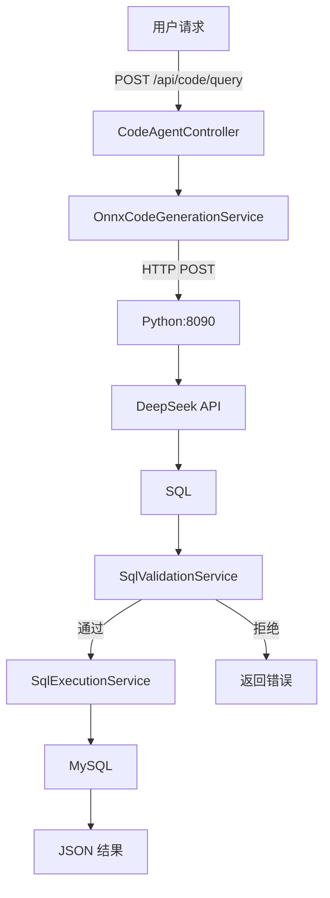

# Code Agent — 银行业务 Text-to-SQL 模块

基于 **LLM** 的自然语言转 SQL 系统，覆盖银行 6 张核心表。Java 后端通过 HTTP 调用 Python 推理服务，生成的 SQL 经 5 层白名单校验后直接执行并返回结果。

---

## 一、项目概述

```
用户输入: "查询余额大于50000的账户"
    ↓
Java Code Agent (8084) → Python 推理服务 (8090) → LLM API → SQL 生成
    ↓
白名单校验 (5层) → MySQL 执行 → JSON 结果返回
```

### 核心指标

| 指标 | 数值 |
|------|:---:|
| 推理引擎 | LLM API |
| Prompt 上下文 | 完整 6 表 DDL + 列注释（从 MySQL 动态加载） |
| SQL 可执行率 | **≈100%**（白名单兜底） |
| 覆盖数据表 | 6 张（bank_customer, bank_account, bank_transaction, bank_department, bank_employee, bank_loan） |
| 推理延迟 | ~1-3s（API 调用） |

---

## 二、环境要求

| 组件 | 版本 | 用途 |
|------|------|------|
| Java | 17 | Spring Boot 运行环境 |
| Maven | 3.9+ | 后端构建 |
| MySQL | 8.0+ | 业务数据库 |
| Python | 3.10+ | 推理服务运行 |
| Flask | 3.0+ | HTTP API 框架 |
| openai | 1.0+ | LLM API 调用 |
| API Key | — | 配置在 `data/ds_config.json` 中 |

> ⚠️ Redis 非必须——元数据缓存失败时会自动降级到 MySQL 直读。

---

## 三、快速启动

### 3.1 准备数据库

```bash
# 1. 创建数据库
mysql -u root -p -e "CREATE DATABASE IF NOT EXISTS agent_platform CHARACTER SET utf8mb4"

# 2. 导入表结构和测试数据
mysql -u root -p agent_platform < src/main/resources/banking_data.sql
```

### 3.2 配置 API Key

编辑 `data/ds_config.json`，填入你的 API Key：

```json
{
  "api_key": "sk-xxxxxxxxxxxxxxxx"
}
```

### 3.3 启动 Python 推理服务

```bash
cd data
pip install flask openai pymysql   # 首次需安装依赖
python infer_server.py             # 启动在 http://localhost:8090
```

输出应显示：
```
🚀 Text-to-SQL Inference Server
   Schema: 6 tables (MySQL dynamic)
   Port:   8090
 * Running on http://127.0.0.1:8090
```

### 3.4 启动 Java 后端

```bash
# 在项目根目录
mvnw.cmd spring-boot:run          # Windows
# 或
./mvnw spring-boot:run             # Linux/macOS
```

输出应显示：
```
Started CodeAgentApplication in 4.398 seconds
? 缓存预热完成！已加载 9 张表的元数据
```

### 3.5 测试接口

```bash
curl -X POST http://localhost:8084/api/code/query \
  -H "Content-Type: application/json" \
  -d '{"question": "查询所有客户"}'
```

返回：
```json
{
  "success": true,
  "sql": "SELECT * FROM bank_customer",
  "columns": ["id", "customer_no", "name", ...],
  "rows": [{"id": 1, "name": "张三", ...}, ...],
  "rowCount": 5,
  "inferenceMethod": "LLM",
  "whitelistPassed": true
}
```

---

## 四、项目结构

```
code-agent/
├── pom.xml                              # Spring Boot 3.2.0 配置
├── .gitignore                           # 排除模型权重 & 编译产物
├── mvnw.cmd                             # Maven Wrapper
│
├── data/                                # Python 训练 & 推理
│   ├── text2sql_dataset.json            # 120 条训练数据
│   ├── train_simple.py                  # 微调脚本（PyTorch 原生训练循环）
│   ├── infer_server.py                  # Flask 推理服务器 (port 8090)
│   ├── eval_quick.py                    # 准确率评测（MySQL 执行对比）
│   ├── show_results.py                  # 逐条结果对比
│   └── README.md
│
└── src/
    ├── main/java/com/agent/code/
    │   ├── CodeAgentApplication.java    # Spring Boot 启动类
    │   ├── config/
    │   │   ├── CodeAgentProperties.java # 配置属性绑定
    │   │   ├── MetadataCacheManager.java# 缓存预热调度
    │   │   └── OnnxConfig.java          # ONNX 配置
    │   ├── controller/
    │   │   └── CodeAgentController.java # REST API (7 个端点)
    │   ├── dto/
    │   │   ├── CodeGenerationRequest.java
    │   │   ├── CodeGenerationResponse.java
    │   │   └── MetadataCacheResponse.java
    │   ├── entity/
    │   │   ├── TableMetadata.java       # 表元数据
    │   │   └── ColumnMetadata.java      # 列元数据
    │   └── service/
    │       ├── CodeGenerationService.java       # 接口
    │       ├── OnnxCodeGenerationService.java   # LLM 推理（唯一实现）
    │       ├── SqlValidationService.java        # 5层白名单
    │       ├── SqlExecutionService.java         # SQL 执行
    │       └── MetadataCacheService.java        # 元数据缓存
    ├── main/resources/
    │   ├── application.yml              # 应用配置
    │   ├── banking_data.sql             # 核心 3 表 DDL + 测试数据
    │   ├── hr_loan_data.sql             # 扩展表
    │   └── models/README.md
    └── test/java/com/agent/code/
        └── SqlValidationServiceTest.java      # 白名单测试 (21 cases)
```

---

## 五、API 接口

基路径：`http://localhost:8084/api/code`

| 方法 | 路径 | 说明 |
|------|------|------|
| POST | `/query` | 一键生成 SQL + 执行（推荐） |
| POST | `/generate` | 仅生成 SQL，不执行 |
| POST | `/validate` | 校验 SQL 是否通过白名单 |
| GET | `/metadata` | 查看缓存的表结构 |
| POST | `/metadata/refresh` | 手动刷新元数据缓存 |
| GET | `/health` | 健康检查 |

### 请求示例

```json
// POST /api/code/query
{ "question": "统计每种交易类型的笔数" }

// POST /api/code/validate
{ "sql": "SELECT * FROM bank_customer" }
```

---

## 六、推理原理

### 6.1 Prompt 设计

LLM 的 system prompt 包含三部分：

1. **角色设定**：「你是一位顶级的 MySQL Text-to-SQL 专家」
2. **完整表结构**：所有 6 张表的 CREATE TABLE 语句（含列注释、外键关系、索引）
3. **生成规则**：10 条 SQL 规范约束（只读 SELECT、反引号、JOIN 关联等）

### 6.2 Schema 加载策略

- **优先** 从 MySQL `information_schema` 动态读取完整 DDL
- **兜底** 若 MySQL 不可用，使用硬编码的 6 张表 schema

这样新增表或修改表结构后无需改动代码，prompt 始终与实际数据库同步。

### 6.3 历史：T5 训练（已弃用）

<details>
<summary>点击展开——T5-small 微调细节</summary>

```bash
cd data
python train_simple.py
```

| 超参数 | 值 |
|--------|:--:|
| Epochs | 8 |
| Learning Rate | 3e-5 |
| Batch Size | 4 |
| 训练集/测试集 | 96 / 24 (8:2) |
| 基础模型 | cssupport/t5-small-awesome-text-to-sql |

</details>

### 6.4 评测

```bash
python eval_quick.py    # MySQL 执行准确率
python show_results.py  # 逐条对比
```

---

## 七、SQL 白名单（5 层防护）

| 层级 | 规则 | 示例 |
|:--:|------|------|
| 1 | 仅允许 `SELECT` | 拒绝 UPDATE/DELETE/DROP |
| 2 | 禁止危险关键字 | 拒绝 UNION/INSERT/EXEC |
| 3 | 表名白名单 | 仅允许 information_schema 中存在的表 |
| 4 | 列名白名单 | 仅允许表中实际存在的列 |
| 5 | 复杂度限制 | 拒绝过深嵌套子查询 |

---

## 八、架构设计



---

## 九、合并到主工程

本模块可独立运行，也可作为 `linchuanbin-tmp/Project` 的子模块合并。合并时注意：

1. **Spring Boot 版本**：主工程用 3.1.8，本模块用 3.2.0，建议统一
2. **端口**：8084，与现有服务（8080/8081/8082/8083）无冲突
3. **数据库**：共用 `agent_platform`，执行 `banking_data.sql` 即可
4. **模型推理**：使用 LLM API，无需本地模型文件，配置写在 `data/ds_config.json` 中

---

## 十、已知限制

| 限制 | 说明 |
|------|------|
| 覆盖 6 张表 | bank_customer / bank_account / bank_transaction / bank_department / bank_employee / bank_loan |
| 仅 SELECT | 不支持 INSERT/UPDATE/DELETE（安全设计） |
| LLM API | 需网络连接和有效 API Key |
| 推理延迟 | ~1-3s（API 网络调用） |
| 上下文窗口 | DeepSeek 支持 128K token，远超 T5 的 512 token |
