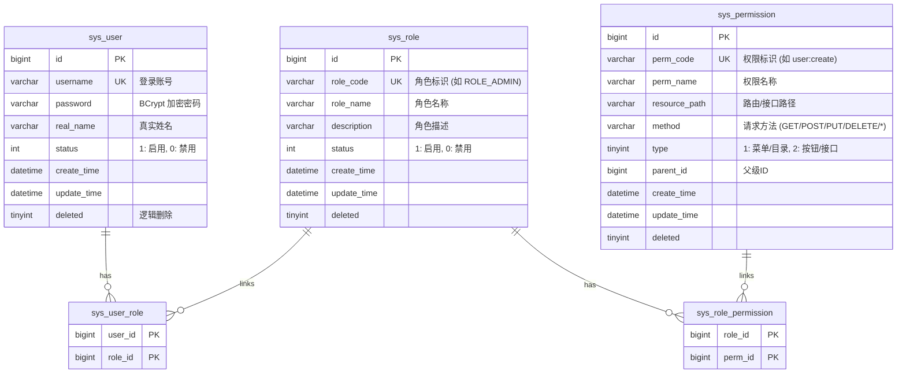

# BankAgent 后端 RBAC 权限设计文档

本项目采用经典的 **RBAC (Role-Based Access Control，基于角色的访问控制)** 模型对系统内员工的访问进行安全管控，以保障银行内部系统的数据安全与合规。

---

## 一、系统角色定义

当前设计中包含以下两类最基础的角色：

1. **`ROLE_ADMIN` (系统管理员)**
   * **适用人员**：行内系统运维团队或部门主管。
   * **权限范围**：用户账号创建/审核、角色分配、禁用/启用员工账户、修改全局参数配置、查看全局审计。
2. **`ROLE_USER` (普通员工/行内经办人员)**
   * **适用人员**：使用 Agent 助理的日常业务人员。
   * **权限范围**：调用 RAG 知识库检索、新建或提交 Code 任务、发起 Tool 工具调用。

---

## 二、数据库结构设计

系统通过 5 张数据库表建立“用户 - 角色 - 权限”之间的关联关系：



---

## 三、微服务鉴权架构流程

本架构采用 **“网关层统一初校验 + 下游微服务细粒度拦截”** 的分层鉴权策略。

### 1. 鉴权总体流程

1. **用户登录 (`POST /api/user/login`)**
   * 用户输入用户名/密码。
   * `user-service` 校验凭证，并从 `sys_role` 及 `sys_permission` 表中查询该用户关联的角色与权限列表。
   * 签名生成 JWT，将 `roles` 数组和 `permissions` 数组放入 JWT 的 Claim 载荷中。
2. **网关校验 (`gateway-service` 的全局拦截器)**
   * 所有以 `/api/**`（除登录/注册白名单外）的请求在经过网关时被拦截。
   * 网关通过共享密钥对 JWT Token 进行合法性及有效期验证。如果无效则直接返回 `401 Unauthorized`。
   * 校验成功后，网关解析 Token 里的用户信息，并以 HTTP Request Header 的形式向下游服务透传：
     * `X-User-Name`: 登录用户名
     * `X-User-Roles`: 角色数组转为以逗号分隔的字符串
     * `X-User-Permissions`: 权限数组转为以逗号分隔的字符串
3. **服务内拦截（`user-service` / `task-service` 的 Security 拦截）**
   * 服务内配备 `JwtAuthenticationFilter` 安全过滤器，如果收到带有 Token 的请求，同样进行就地解析，并将 `roles` 和 `permissions` 转化为 Spring Security 的 `GrantedAuthority` 列表存入 `SecurityContextHolder`。
   * 采用方法级注解 `@PreAuthorize("hasRole('ADMIN')")` 或 `@PreAuthorize("hasAuthority('user:create')")` 来做精细的越权保护。

---

## 四、核心接口定义

### 1. 用户认证模块

* **用户注册**
  * `POST /api/user/register` (放行)
  * 参数：`{"username": "xxx", "password": "xxx", "realName": "xxx"}`
  * 逻辑：写入 `sys_user` 表，默认插入 `sys_user_role` 将其角色设置为 `ROLE_USER`。
* **用户登录**
  * `POST /api/user/login` (放行)
  * 返回：
    ```json
    {
      "code": 200,
      "message": "success",
      "data": {
        "token": "eyJhbGciOi...",
        "username": "zhangsan",
        "realName": "张三",
        "roles": ["ROLE_USER"],
        "permissions": ["task:submit", "task:query"]
      }
    }
    ```
* **获取当前登录人信息**
  * `GET /api/user/info` (需登录)
  * 返回：当前解析出的用户详情、角色与权限数组。

### 2. 管理员管理模块 (需 `ROLE_ADMIN` 角色)

* **用户列表查询**
  * `GET /api/admin/users`
  * 返回系统所有员工的账号状态、创建时间及所属角色列表。
* **分配员工角色**
  * `POST /api/admin/user/role`
  * 参数：`{"userId": 102, "roleId": 2}`
* **禁用/启用员工账号**
  * `PUT /api/admin/user/status`
  * 参数：`{"userId": 102, "status": 0}` (0为禁用，1为启用)
* **系统可用角色列表**
  * `GET /api/admin/roles`
