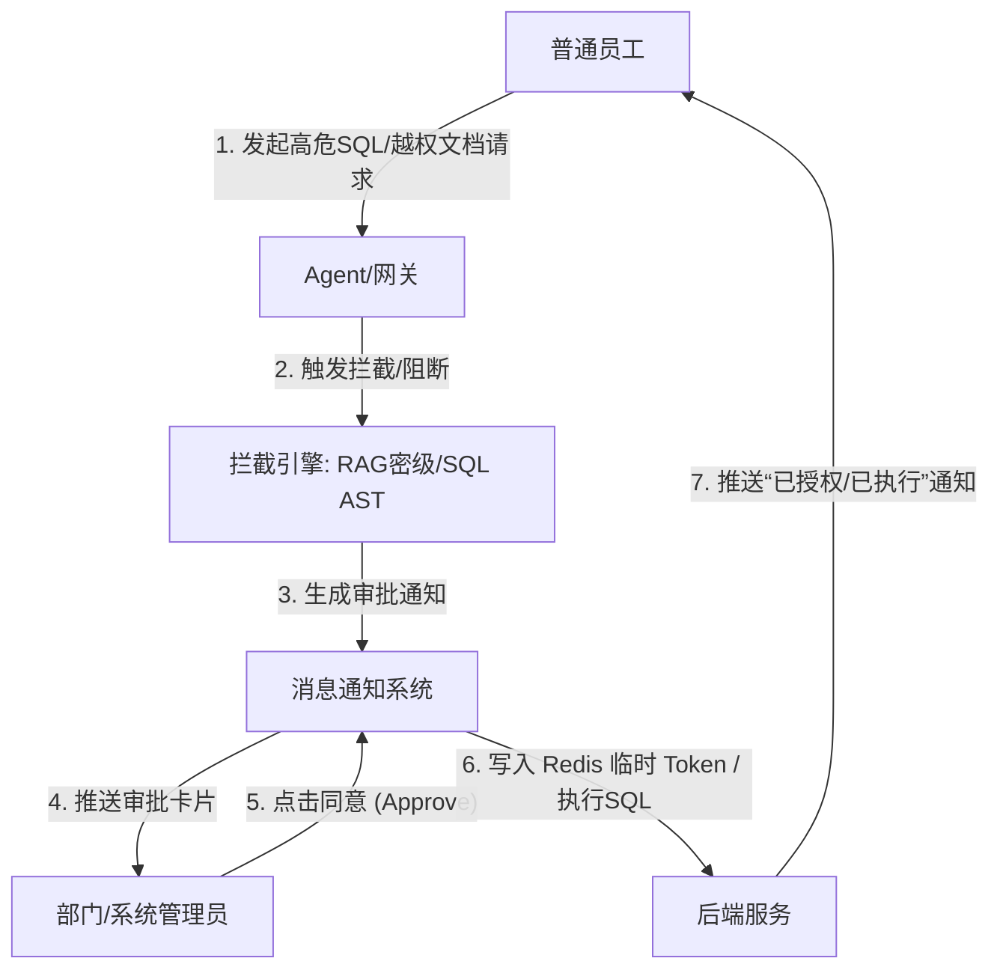
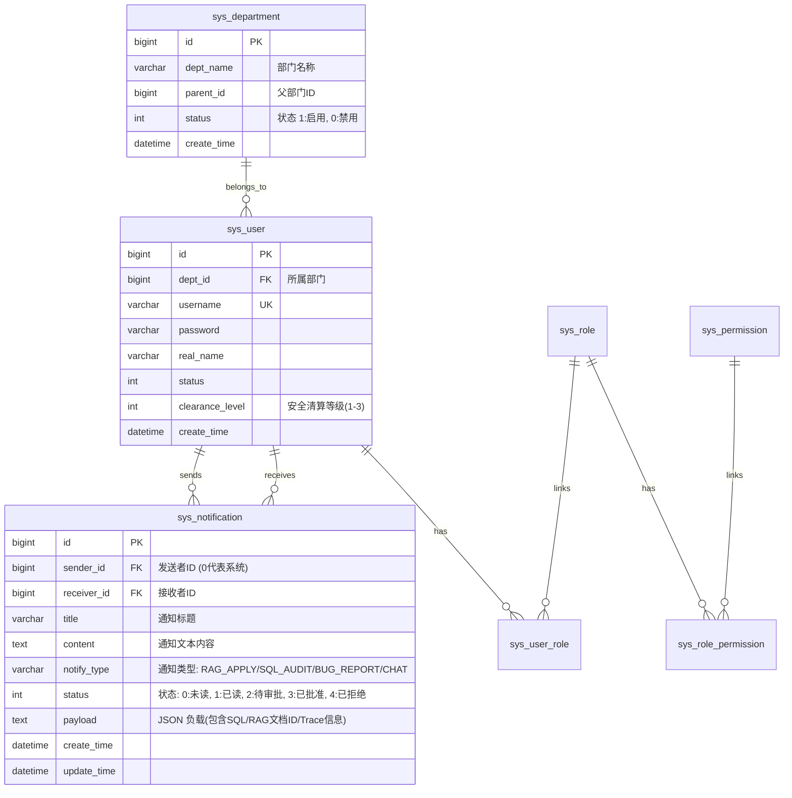

# BankAgent 企业级三级 RBAC 与人机协同 (HITL) 通知系统设计

本项目针对银行/金融机构的真实业务场景，对原有的“系统管理员 - 普通用户”二级权限体系进行重构，升级为**企业级三级 RBAC 架构（引入“部门管理员”）**，并配套设计了**智能体人机协同（Human-in-the-Loop, HITL）消息通知系统**。

此设计不仅契合银行严密的组织架构与数据安全规范，更通过 **RAG 元数据过滤（Metadata Filtering）** 与 **SQL AST（抽象语法树）审计引擎** 提升了项目的技术深度与学术价值，避免了被评委质疑为纯粹的 CRUD 系统。

---

## 一、 企业级三级 RBAC 角色体系

为了实现严格的部门隔离与职责分立（Separation of Duties），系统定义了以下三类核心角色：

### 1. 角色职责定义

| 角色标识 | 角色名称 | 核心职责与权限范围 | 限制条件 |
| :--- | :--- | :--- | :--- |
| **`ROLE_ADMIN`** | **系统管理员** | 负责 IT 运维、系统配置（如大模型 API Key、系统白名单配置）、全局日志审计、系统级账号审批与分配。 | **禁止参与具体业务**。不能随意查看部门内部敏感财务数据，不能直接管理部门知识库。 |
| **`ROLE_DEPT_ADMIN`** | **部门管理员** | 负责本部门的业务管理与员工日常审批。拥有上传、更新和维护本部门专属知识库（如《信贷审批内控手册》）的权力，并对本部门文档进行密级划分；审批本部门普通员工的临时越权申请。 | **无权更改系统后台设置**（如修改系统密钥、管理系统白名单等）。 |
| **`ROLE_USER`** | **普通员工** | 只能使用本部门已授权的 RAG 知识库与数据 Schema，通过 Agent 执行日常的金融查询、报表生成等任务。 | 默认无权跨部门检索文档；生成的 SQL 语句若包含敏感操作（如 `DELETE`/`DROP`）会被系统阻断并提交审批。 |

### 2. 组织架构设计
系统引入**部门（Department）**概念，普通员工与部门管理员均必须归属于某一特定部门。
* 示例部门：信贷审批部（Credit Department）、合规管理部（Compliance Department）、资产管理部（Asset Management Department）。
* 部门树支持多级扩展，子部门默认继承父部门的知识库安全边界，但支持细粒度覆盖。

---

## 二、 核心学术价值：对齐 RAG Metadata Filtering

在传统的 RAG 系统中，所有用户共享同一个向量数据库（如 Milvus），这在银行场景下会导致严重的越权风险（例如：信贷部员工查到了合规部甚至 HR 的保密文件）。

本设计通过在检索阶段引入**元数据过滤（Metadata Filtering）**，在物理或逻辑上实现部门间文档的绝对安全隔离：

### 1. 检索公式设计
当普通员工向 Business Agent 提问时，系统在将问题向量化（Embedding）后，后端服务在向 Milvus 发起向量检索时，会自动从当前用户的 Token 中提取其所属的 `department_id`，并带入过滤条件：

$$\text{Search}(\vec{q}) \quad \text{subject to} \quad \text{document.department\_id} = \text{user.department\_id}$$

### 2. 多级安全防护网
* **L1 (部门隔离)**：`document.department_id == user.department_id`
* **L2 (密级管控)**：文档与用户均关联安全等级（Level 1-3）。用户只能检索安全等级 $\le$ 自身 Clearance Level 的文档。
* **L3 (动态授权)**：当用户需要临时访问高密级或跨部门文档时，触发 **RAG 越权申请流**（详见下文）。

---

## 三、 智能体人机协同 (HITL) 消息通知系统

绝对不能把通知系统做成单纯的“网页版聊天”。本系统的通知机制是**作为 AI Agent 运行过程中的“人机协同”与“异常升级通道”**。



### 场景 A：RAG 越权申请流 (Permission Escalation Workflow)
1. **触发条件**：普通员工向 RAG 助手提问：“帮我查一下 A 公司的授信评估报告。”
2. **系统拦截**：RAG 检索模块发现该文档密级为 `Level-3 (Confidential)`，而该员工仅有 `Level-1` 权限。
3. **协同流转**：Agent 不直接报错，而是向该员工的**部门管理员**发送一条审批通知：
   > **通知标题**：RAG 临时越权访问申请
   > **通知内容**：员工【张三】因任务需要，申请临时访问《A公司授信评估报告》（密级：Level-3）。
   > **操作选项**：[ 批准 (Approve) ]  [ 拒绝 (Deny) ]
4. **临时授权**：部门管理员点击【批准】，后端在 **Redis** 中写入一个临时 Token，并设置过期时间（如 TTL = 2 小时）：
   * Key: `auth:temp:user_{userId}:doc_{docId}`，Value: `GRANTED`
5. **闭环通知**：系统向员工推送通知：“您的临时访问申请已通过，时效为 2 小时。” 此时 AI 自动允许其检索该文档。

### 场景 B：SQL 执行阻断与人工审核流 (SQL AST Escalation)
1. **触发条件**：普通员工通过 Code Agent 输入：“帮我删掉 2025 年多余的流水记录。”
2. **生成与拦截**：Code Agent 生成了 SQL：`DELETE FROM bank_ledger WHERE ...`。后端 SQL 审计引擎通过 **AST（抽象语法树）** 分析，识别出包含高危的 `DELETE` 关键字或无 `WHERE` 条件的 `UPDATE`。
3. **协同流转**：系统阻断 SQL 执行，并向**系统管理员**（或所属**部门管理员**）推送高急迫度通知：
   > **警告通知**：高危 SQL 执行审核请求
   > **通知内容**：员工【张三】试图执行数据库修改操作。
   > **生成的 SQL**：`DELETE FROM bank_ledger WHERE create_time < '2025-01-01'`
   > **操作选项**：[ 放行 SQL (Release) ]  [ 作废 SQL (Deny) ]
4. **审核响应**：管理员审核 SQL，若点击【放行】，后端执行该 SQL 并记录审计日志；若点击【作废】，该 SQL 彻底失效并向用户反馈“执行被管理员拒绝”。

### 场景 C：AI 幻觉/Bug 一键追溯反馈 (Hallucination & Bug Trace Reporting)
1. **触发条件**：普通员工在使用过程中，发现 AI 回答了一句明显是幻觉的话，或者生成的 SQL 报了数据库错误。
2. **反馈触发**：员工在前端界面点击 AI 答复框下方的【反馈幻觉/报错 (Report Bug)】。
3. **数据打包**：系统自动捕获当前的 **AI 推理全链路 Trace 数据**（Payload 包括：当时的原始 Prompt、RAG 从向量库检索出的 Top-K 文本片段、大模型生成的原始 SQL、执行报错的 StackTrace 堆栈）。
4. **协同流转**：打包数据作为一条 Bug 消息发送给**系统管理员**。
5. **Debug 可视化**：系统管理员在后台点击该通知，可以直接进入一个“Debug 画布”，可视化回溯整个 AI 链条，定位是 Prompt 注入、向量库检索不准还是 LLM 自身幻觉导致的问题。

---

## 四、 数据库结构设计 (Database Schema)

为了支持上述的部门层级和 HITL 消息通知系统，我们对数据库进行了扩展：



### 1. 核心表 SQL DDL

```sql
-- 1. 部门信息表
CREATE TABLE `sys_department` (
  `id` bigint(20) NOT NULL AUTO_INCREMENT COMMENT '主键ID',
  `dept_name` varchar(50) NOT NULL COMMENT '部门名称',
  `parent_id` bigint(20) DEFAULT 0 COMMENT '父部门ID',
  `status` tinyint(4) DEFAULT 1 COMMENT '部门状态（1:启用 0:禁用）',
  `create_time` datetime DEFAULT CURRENT_TIMESTAMP COMMENT '创建时间',
  `update_time` datetime DEFAULT CURRENT_TIMESTAMP ON UPDATE CURRENT_TIMESTAMP COMMENT '修改时间',
  `deleted` tinyint(4) DEFAULT 0 COMMENT '是否删除（1:已删 0:未删）',
  PRIMARY KEY (`id`)
) ENGINE=InnoDB DEFAULT CHARSET=utf8mb4 COMMENT='部门组织架构表';

-- 2. 用户表扩展（增加部门ID和安全等级）
CREATE TABLE `sys_user` (
  `id` bigint(20) NOT NULL AUTO_INCREMENT,
  `dept_id` bigint(20) NOT NULL COMMENT '所属部门ID',
  `username` varchar(50) NOT NULL COMMENT '用户名',
  `password` varchar(100) NOT NULL COMMENT '密码',
  `real_name` varchar(50) DEFAULT NULL COMMENT '真实姓名',
  `status` tinyint(4) DEFAULT 1 COMMENT '账号状态（1:启用 0:禁用）',
  `clearance_level` tinyint(4) DEFAULT 1 COMMENT '安全清算等级（1:公开 2:内部 3:机密）',
  `create_time` datetime DEFAULT CURRENT_TIMESTAMP,
  `update_time` datetime DEFAULT CURRENT_TIMESTAMP ON UPDATE CURRENT_TIMESTAMP,
  `deleted` tinyint(4) DEFAULT 0,
  PRIMARY KEY (`id`),
  UNIQUE KEY `idx_username` (`username`),
  KEY `idx_dept_id` (`dept_id`)
) ENGINE=InnoDB DEFAULT CHARSET=utf8mb4 COMMENT='系统用户表';

-- 3. 人机协同消息通知表
CREATE TABLE `sys_notification` (
  `id` bigint(20) NOT NULL AUTO_INCREMENT COMMENT '通知ID',
  `sender_id` bigint(20) NOT NULL DEFAULT 0 COMMENT '发送者用户ID（0代表系统自动触发）',
  `receiver_id` bigint(20) NOT NULL COMMENT '接收人用户ID',
  `title` varchar(100) NOT NULL COMMENT '通知标题',
  `content` text NOT NULL COMMENT '通知文本内容',
  `notify_type` varchar(30) NOT NULL COMMENT '通知类型: RAG_APPLY (越权审批), SQL_AUDIT (SQL拦截审批), BUG_REPORT (幻觉反馈), CHAT (用户私信)',
  `status` tinyint(4) NOT NULL DEFAULT 0 COMMENT '通知状态（0:未读, 1:已读, 2:待审批, 3:已批准, 4:已拒绝）',
  `payload` text DEFAULT NULL COMMENT 'JSON格式的附加负载，用于存储SQL代码、文档ID或大模型Trace链路数据',
  `create_time` datetime DEFAULT CURRENT_TIMESTAMP COMMENT '创建时间',
  `update_time` datetime DEFAULT CURRENT_TIMESTAMP ON UPDATE CURRENT_TIMESTAMP COMMENT '修改时间',
  `deleted` tinyint(4) DEFAULT 0 COMMENT '是否逻辑删除',
  PRIMARY KEY (`id`),
  KEY `idx_receiver_status` (`receiver_id`, `status`),
  KEY `idx_type` (`notify_type`)
) ENGINE=InnoDB DEFAULT CHARSET=utf8mb4 COMMENT='人机协同通知表';
```

---

## 五、 核心 API 接口定义

### 1. 部门管理接口 (仅限 `ROLE_ADMIN`)
* **获取部门树结构**：`GET /api/admin/dept/tree`
* **新增部门**：`POST /api/admin/dept`
  * 参数：`{"deptName": "合规部", "parentId": 1}`
* **更新部门**：`PUT /api/admin/dept`

### 2. 消息通知核心接口 (所有登录用户可用，根据角色展示不同内容)
* **获取当前用户的通知列表**
  * `GET /api/notification/list`
  * 参数：`status` (可选，过滤已读/未读/待审批)
  * 返回：包含通知 ID、类型、标题、内容、`payload` 的列表。
* **标记已读**
  * `PUT /api/notification/read/{id}`
* **提交人机协同审批操作（部门管理员/系统管理员操作）**
  * `POST /api/notification/action`
  * 参数：
    ```json
    {
      "notificationId": 2048,
      "action": "APPROVE", 
      "opinion": "同意临时授权访问该授信报告，时效2小时"
    }
    ```
  * **后端审批通过处理逻辑**：
    * **针对 RAG_APPLY**：将用户 ID 与文档 ID 的临时授权写入 Redis 缓存。
    * **针对 SQL_AUDIT**：调取 `task-service` 异步执行被拦截的 SQL 语句。
    * 更新当前通知状态为已批准 (`status = 3`)。
* **用户主动反馈 AI 幻觉/报错**
  * `POST /api/notification/report-bug`
  * 参数：
    ```json
    {
      "chatSessionId": "session_12345",
      "prompt": "帮我删掉2025年流水记录",
      "modelResponse": "已为您执行删除...",
      "retrievedDocs": "[{\"doc_name\":\"信贷审批手册.pdf\",\"score\":0.92}]",
      "generatedSql": "DELETE FROM bank_ledger WHERE ...",
      "errorMessage": "AST Security Exception: High risk SQL blocked.",
      "userComment": "AI生成的删除语句太危险，并且报错了。"
    }
    ```
    *(后端接收到后会自动向系统管理员推送一条 `BUG_REPORT` 通告，并在 `payload` 中完整保存该 JSON 数据。)*
