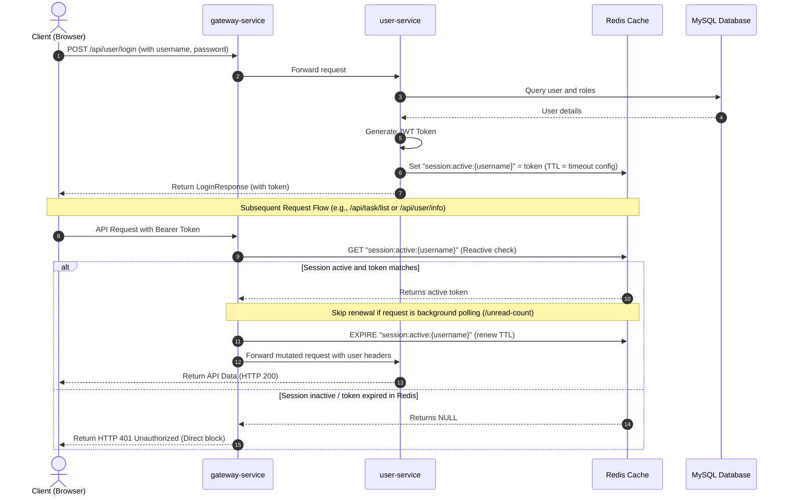

# Session Inactivity Timeout Design Document

This document describes the design and implementation specifications for the Redis-backed session inactivity timeout mechanism in the BankAgent platform. It details the database modifications, the Redis key structure, request validation filters at the Gateway and microservice level, administrator APIs, and frontend integration.

---

## 1. System Architecture

To ensure consistent session validation and TTL renewal across all microservices (gateway, user, task, tool, code), the token verification and sliding window renewal are centralized at the **API Gateway** level.



---

## 2. Database Schema Specifications

We introduce a generic system configuration table `sys_config` to store dynamic parameters, including the session timeout value (in minutes).

```sql
-- Create System Configuration Table
CREATE TABLE `sys_config` (
  `id`          bigint       NOT NULL AUTO_INCREMENT,
  `param_key`   varchar(100) NOT NULL UNIQUE COMMENT 'Config key',
  `param_value` varchar(500) NOT NULL        COMMENT 'Config value',
  `description` varchar(250) DEFAULT NULL    COMMENT 'Description',
  `update_time` datetime     DEFAULT CURRENT_TIMESTAMP ON UPDATE CURRENT_TIMESTAMP,
  PRIMARY KEY (`id`)
) ENGINE=InnoDB AUTO_INCREMENT=2 DEFAULT CHARSET=utf8mb4 COLLATE=utf8mb4_unicode_ci COMMENT='System Configuration Table';

-- Insert default session inactivity timeout (30 minutes)
INSERT INTO `sys_config` (`id`, `param_key`, `param_value`, `description`) VALUES
  (1, 'session_timeout', '30', 'Session inactivity timeout in minutes');
```

---

## 3. Redis Key Structures

### 3.1 Active Session Store
- **Key**: `session:active:{username}`
- **Value**: The current active JWT token string (prevents token reuse after logout or session replacement).
- **TTL**: Initialized and reset to the session timeout config value (in minutes) upon every valid user operation.

### 3.2 Configuration Cache
- **Key**: `sys:config:session_timeout`
- **Value**: Timeout integer (in minutes).
- **TTL**: Persistent (`-1`). Refreshed when an administrator updates the value via the configuration API.

---

## 4. Gateway Implementation Specifications (gateway-service)

The check is integrated into `JwtAuthGlobalFilter.java` using **Reactive Redis**. 

### 4.1 Reactor Empty Stream Handling
A typical Reactor trap involves `Mono<Void>` (which completes empty without emitting any item). Applying `.switchIfEmpty(...)` directly to the end of a chain that returns `Mono<Void>` (such as `chain.filter(...)`) causes the empty block to always trigger, even on successful requests. 

To solve this, the check is applied directly on the initial `redisTemplate.opsForValue().get(...)` publisher, emitting `Mono.error` on missing keys:

```java
// Check Redis session key
return redisTemplate.opsForValue().get(sessionKey)
        // If key is missing from Redis, throw a RuntimeException immediately
        .switchIfEmpty(Mono.defer(() -> Mono.error(new RuntimeException("Session expired due to inactivity."))))
        .flatMap(activeToken -> {
            if (!activeToken.equals(token)) {
                return Mono.error(new RuntimeException("Session expired due to inactivity."));
            }

            // Skip background polling URLs from renewing the session timeout to allow idle expiration
            boolean isBackgroundPoll = path != null && path.endsWith("/notification/unread-count");
            if (!isBackgroundPoll) {
                return redisTemplate.opsForValue().get("sys:config:session_timeout")
                        .defaultIfEmpty("30")
                        .flatMap(timeoutStr -> {
                            long timeout = 30;
                            try { timeout = Long.parseLong(timeoutStr); } catch (NumberFormatException ignored) {}
                            return redisTemplate.expire(sessionKey, java.time.Duration.ofMinutes(timeout));
                        })
                        .then(proceedWithRequest(exchange, chain, username, claims));
            }

            return proceedWithRequest(exchange, chain, username, claims);
        })
        // Catch exceptions (either token verification failure or missing key) and return a unified 401
        .onErrorResume(e -> handleUnauthorized(exchange, e.getMessage()));
```

---

## 5. Backend Service Implementation (user-service)

### 5.1 Token Exemption for Authentication Endpoints
`JwtAuthenticationFilter.java` verifies token sessions for downstream requests. To prevent stale/expired tokens stored in browser localStorage from blocking new login/registration requests, the filter explicitly bypasses authentication verification for `/user/login` and `/user/register`:

```java
String uri = request.getRequestURI();
if ("/user/login".equals(uri) || "/user/register".equals(uri)) {
    filterChain.doFilter(request, response);
    return;
}
```

### 5.2 Administrator Config APIs
Create `SystemConfigController` with path `/user/config`:
- **`GET /user/config/session-timeout`**
  - **Permission**: `@PreAuthorize("hasRole('ROLE_ADMIN')")`
  - **Behavior**: Reads from Redis `sys:config:session_timeout`; if not found, reads from `sys_config` DB, caches in Redis, and returns it.
- **`PUT /user/config/session-timeout`**
  - **Permission**: `@PreAuthorize("hasRole('ROLE_ADMIN')")`
  - **Payload**: `{ "timeout": 45 }`
  - **Behavior**: Updates parameter in `sys_config` table, and updates Redis cache key `sys:config:session_timeout`.

---

## 6. Frontend UI Specifications (web-ui)

### 6.1 Settings Page Integration
Add an "Admin Settings" card to the settings panel, visible only to users with the administrator role:
- Text input for timeout minutes (with client-side validation to ensure it falls between 1 and 1440 minutes).
- Button to dispatch `PUT /api/user/config/session-timeout`.

### 6.2 UX Silent Logout & Persistent Expired Alert
To provide a smooth, transparent UX:
1. **Silent Logout (`logout(true)`)**: When a 401 occurs, the store clears local tokens and states immediately without trying to notify the server (avoiding infinite loops) and skips the generic "Signed Out" success toast.
2. **Redirect to Login with Parameter**: The Axios interceptor redirects the user to `/login?expired=1`.
3. **Persistent Warning Alert Banner**: The login page (`login/index.vue`) checks for the `expired=1` query parameter and displays a persistent warning alert:
   > ⚠️ **登录状态已过期，请重新登录。**
   
   This ensures that when a user returns to their desk after a timeout, the reason for redirection is clear and visible.
